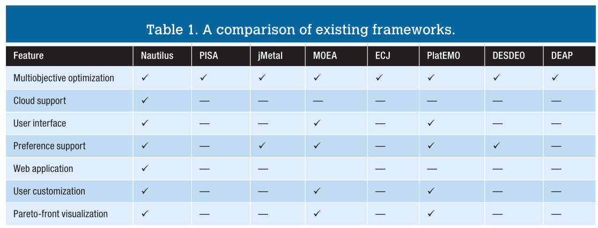
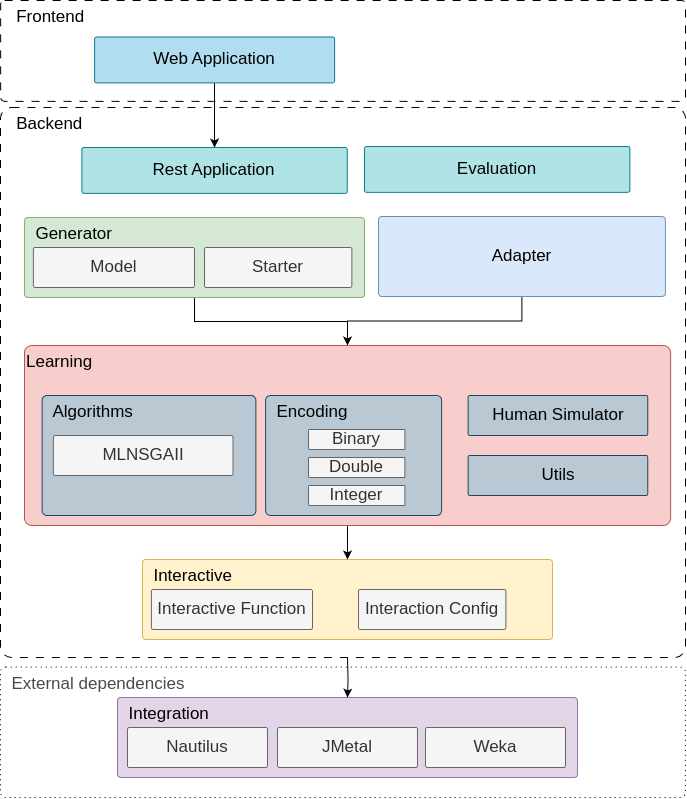

# Welcome to ISearchAI

- ISearchAI is a framework for iSBSE with ML.
- ISearchAI allows the implement iSBSE approaches that use ML algorithms. Also, it makes possible to
  generate new iSBSE approaches code based on Nautilus plugin and adapt existent code basis.
- Nautilus is a framework that provides the needed structure for implementing/running
  iSBSE Approaches and visualization of results.
- Because of that, the Nautilus is a dependency of the ISearchAI
  allowing all the Nautilus features being available in ISearchAI through code reuse.
- There is no conflicting interests between the frameworks, since ISearchAI
  is focused on ML and code generation/adaptation.
- The currently Nautilus version integrated in the ISearchAI is the 1.0.0. So, both frameworks
  can be independently evolved. When new versions of Nautilus is released, we just need to update the ISearch.
  If there is breaking build, the ISearchAI can be updated accordingly.

- In summary, ISearchAI mainly make uses of 3 frameworks.
    - Nautilus, to structure SBSE approaches.
    - JMetal, to implement search algorithms.
    - Weka, to implement ML algorithms.

### Comparison between frameworks
| Feature                      | ISearchAI | Nautilus |
| ---------------------------- |-----------|----------|
| Multiobjective optimization  | v         | v        |
| Cloud Support                | v         | v        |
| User Inteface                | v         | v        |
| Preference Support           | v         | v        |
| Web Application              | v         | v        |
| User Customization           | v         | v        |
| Pareto Front visualization   | v         | v        |
| Machine Learning             | v         | -        |
| Generation of interactive approach code           | v         | -        |
| Adaptation of existent interactive approach code           | v         | -        |

Since Nautilus already presented a comparison with other framework, below we present the comparsion.

## ISearchAI Modules

