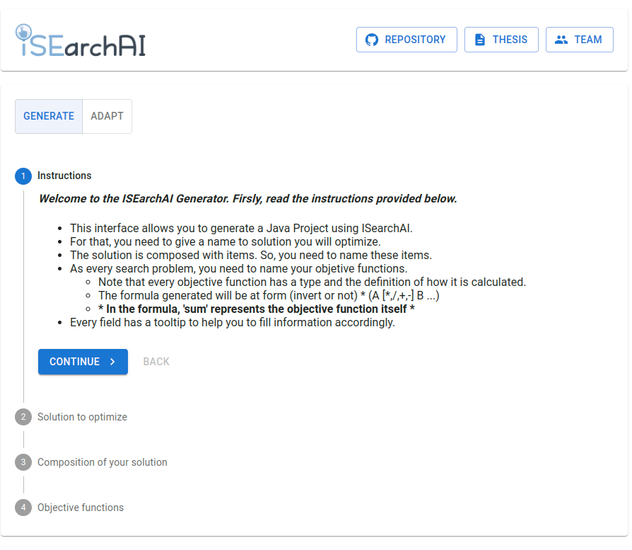
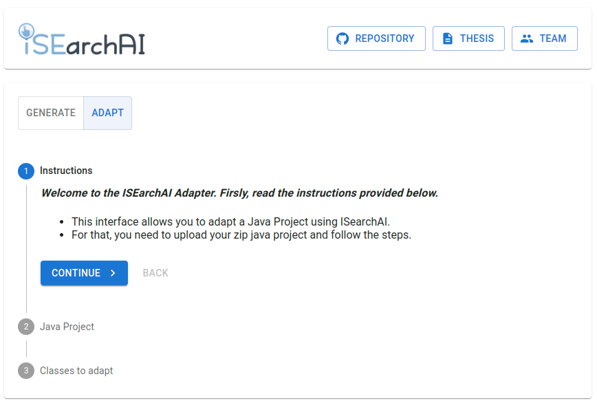

# How to use the framework

- If are getting started with a new interactive approach, you can use the ISearchAI generator to create a new java project.
- If you already have an interactive approach, you can use the ISearchAI Adapter to adapt you java project.
- If you want to programmatically implement you approach, you can add the maven dependency of the framework in your project.

### Requirements

- At least Java 8 - For implementing you interactive approach
- Maven - To manage java dependencies
- Git - To clone the project and manage your projects

### So, lets getting started

- Firstly, you need to clone the project using GIT: git clone git@github.com:iSEarchAI/isearchai.git
- Enter the folder and run "mvn clean install -DskipTests" for compiling the project

### Using the generator and the adapter frontend application

- For running the FrontEnd application, just execute "java -jar target/isearchai-1.0.0.jar" after the compilation ("mvn clean install" step)
- With this, you can generate or adapt interactive approaches using the framework.

For using the approach generator, you may access http://localhost:8080 and follow the generate steps.



For using the approach adapter, you need just to click in adapt tab and follow the instructions.

There are 4 classes needed for the framework to work. They are:
- Search Algorithm -> Solution Set -> Solution -> Element





### Coding classes

Lets explain the classes we mentioned here.

#### Search algorithm

Represented by [MLSearchAlgorithm](src/main/java/br/otimizes/isearchai/core/MLSearchAlgorithm.java) interface which has 2 methods. The first one is for training the machine learning model and the second is used for interacting with the DM.

```java
public interface MLSearchAlgorithm<T extends MLSolutionSet<S, E>, S extends MLSolution<E>, E extends MLElement> {

    /**
     * Train the model
     *
     * ISEARCHAI::EXAMPLE::{interaction.subjectiveAnalyzeAlgorithmEvaluate(solutionSet);}
     * @param solutionSet
     */
    void trainModel(T solutionSet);

    /**
     * Interact with DM
     *
     * ISEARCHAI::EXAMPLE::{return interaction.interactWithDMUpdatingInteraction(offspringPopulation, bestOfUserEvaluation, generation);}
     * @param offspringPopulation
     * @param bestOfUserEvaluation
     * @param generation
     * @return
     */
    int interactWithDM(T offspringPopulation, HashSet<S> bestOfUserEvaluation, int generation);
}

``` 

#### Solution Set

Represented by the abstract class [MLSolutionSet](src/main/java/br/otimizes/isearchai/core/MLSolutionSet.java). This class has 4 methods you will need to implement which are used by the framework.


```java
...
    
    public abstract double[][] writeObjectivesAndElementsNumberToMatrix();

    public abstract double[] writeObjectivesFromElements(E MLElement, S MLSolution);

    public abstract double[] writeCharacteristicsFromElement(E MLElement, S MLSolution);

    public abstract List<E> getAllElementsFromSolution(S MLSolution);
```

#### Solution

Represented by [MLSolution](src/main/java/br/otimizes/isearchai/core/MLSolution.java) Every solution set has many solutions. Your class that implements this interface will need to implement those methods. If you are familiarized with JMetal, you will observe that this interface is similar to Solution interface in JMetal.

```java
...
    
public interface MLSolution<T extends MLElement> extends Solution<T> {
    double[] getObjectives();

    int numberOfObjectives();

    double getObjective(int i);

    void setClusterId(Double assignment);

    void setClusterNoise(Boolean b);

    Double getClusterId();

    void setEvaluation(int i);

    List<T> getElements();

    boolean containsElementsEvaluation();

    int getEvaluation();

    boolean getEvaluatedByUser();
}
```

#### Element

A solution can be composed of elements. This elements are represented by the [MLElement](src/main/java/br/otimizes/isearchai/core/MLElement.java) interface. This interface is not obligatory. You may have problem with simple representation as double or integer which does not require this implementation.


```java
public interface MLElement {
    boolean setFreezeFromDM(boolean v);

    boolean isFreezeByDM();
}
```